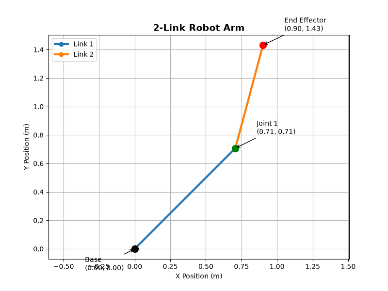

# 🤖 Robotics Arm Control

A Python-based robotics project demonstrating:

* Forward Kinematics
* Inverse Kinematics
* Trajectory Planning
* Robotic Arm Visualisation

for a planar robotic manipulator.

The objective of this project is to build a working, testable robotics simulation while developing practical skills in robotics, automation, control systems, and engineering software development.

---

# 🚀 Demo

## Robot Arm Visualisation

The figure below illustrates the forward kinematics simulation of a two-link planar robotic arm.

[Robot Arm Visualisation](images/robot_arm_visualisation.png)

The robotic arm is visualised using Matplotlib.

Given:

* Joint Angles
* Link Lengths

the simulation calculates:

* Joint 1 Position
* Joint 2 Position
* End-Effector Position

and displays the robotic arm configuration graphically.

This provides visual verification that the forward kinematics calculations are functioning correctly.

### Example Output



### Planned Future Outputs

* Animated arm motion
* Trajectory tracking visualisation
* Joint angle plots
* End-effector error plots

---

# ⚙️ Key Features

### Current Features

✅ Forward Kinematics Implementation

✅ End-Effector Position Calculation

✅ Engineering Documentation

### Features In Development

🔄 Inverse Kinematics Solver

🔄 Trajectory Tracking

🔄 Simulation Environment

🔄 Matplotlib Visualisation

### Planned Features

🚀 PID Control

🚀 ROS Integration

🚀 Obstacle Avoidance

🚀 3D Robotic Arm Simulation

---

# 📐 Forward Kinematics

Forward kinematics calculates the position of the robot arm's end effector from the known joint angles and link lengths.

For a two-link planar robotic arm:

```text
x = L1 cos(theta1) + L2 cos(theta1 + theta2)

y = L1 sin(theta1) + L2 sin(theta1 + theta2)
```

Where:

* L1 = Length of Link 1
* L2 = Length of Link 2
* theta1 = Joint 1 Angle
* theta2 = Joint 2 Angle
* x, y = End-Effector Position

### Example Input

```text
L1 = 1.0
L2 = 0.75

theta1 = 45°
theta2 = 30°
```

### Example Output

```text
End-effector position:

x = 0.901
y = 1.431
```

---

# 📊 Results

The forward kinematics implementation successfully computes the end-effector position for a two-link planar manipulator.

### Test Case

```text
L1 = 1.0m
L2 = 0.75m

theta1 = 45°
theta2 = 30°
```

### Result

```text
x = 0.901m
y = 1.431m
```

### Planned Future Results

```text
Target Position: (0.5, 0.3)

Computed Joint Angles

End-Effector Trajectory Plot

Final Position Error
```

---

# 📁 Project Structure

```text
robotics-arm-control/

│── src/
│   ├── kinematics.py
│   ├── controller.py
│   ├── simulator.py
│   └── visualisation.py
│
│── tests/
│   └── test_kinematics.py
│
│── images/
│   └── robot_arm_visualisation.png
│
│── results/
│   ├── gifs/
│   └── plots/
│
│── main.py
│── requirements.txt
│── README.md
```

---

# 🛠️ Installation & Usage

Clone the repository:

```bash
git clone https://github.com/SteamHunter360/robotics-arm-control.git

cd robotics-arm-control
```

Install dependencies:

```bash
pip install -r requirements.txt
```

Run the simulation:

```bash
python main.py
```

---

# 🎯 Expected Behaviour

When complete:

* A simulation window opens
* The robotic arm is displayed
* The arm moves toward a target position
* Trajectory plots are generated
* Simulation results are saved automatically

---

# 🧪 Testing

Run validation tests:

```bash
pytest tests/
```

Testing verifies:

* Forward Kinematics Correctness
* Inverse Kinematics Accuracy
* End-Effector Position Error
* Numerical Stability

---

# 🔮 Future Development

Planned improvements include:

* Inverse Kinematics Solver
* Animated Robotic Arm Motion
* PID Joint Control
* ROS Integration
* Gazebo Integration
* Obstacle Avoidance
* 3DOF Extension
* 6DOF Extension
* 3D Simulation Environment

---

# 🧠 What I Learned

This project is helping develop practical understanding of:

* Forward Kinematics
* Inverse Kinematics
* Robotics Mathematics
* Control Systems
* Numerical Methods
* Python Engineering Applications
* Engineering Software Development

---

# 📌 Notes

This project is intentionally focused on building a working robotics system with visible outputs and engineering validation rather than theoretical discussion alone.

The emphasis is on producing a testable simulation that demonstrates robotics concepts through implementation.

---

# 👤 Author

Mechanical Engineering Student

Interested in:

* Robotics
* Automation
* Control Systems
* Mechanical Engineering
* Engineering Software Development
* Mechatronics
