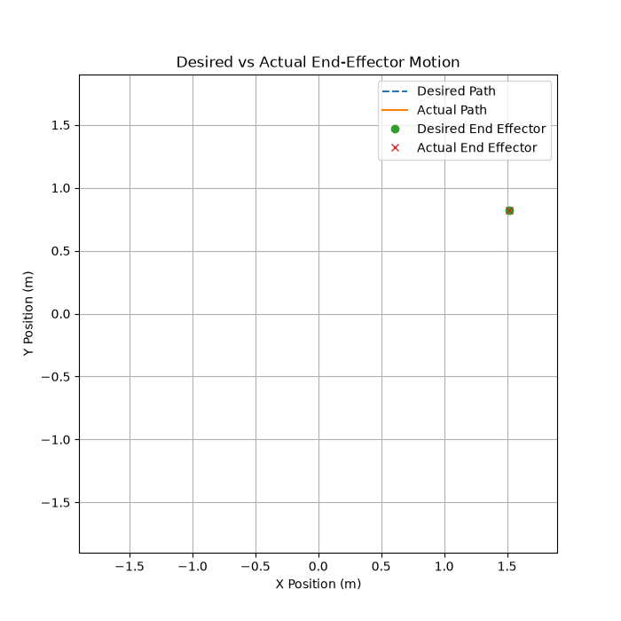
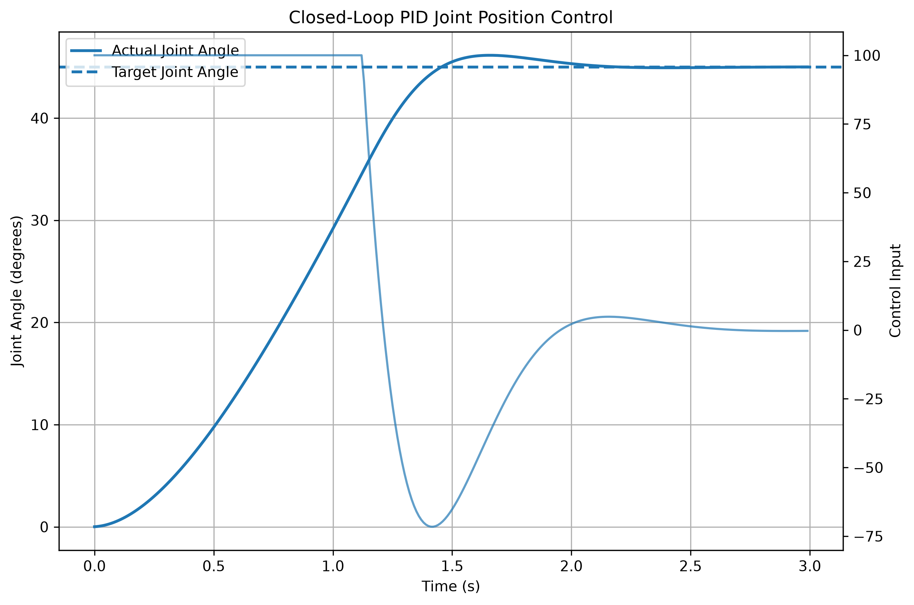
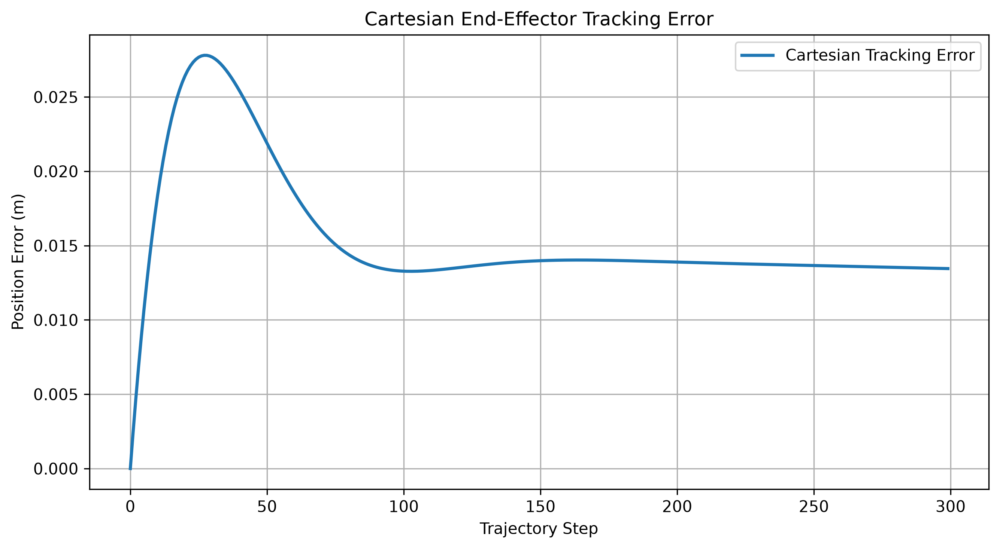

# 🤖 Robotics Arm Control

[](https://github.com/SteamHunter360/robotics-arm-control/actions/workflows/tests.yml)

A Python robotics and control-systems project implementing the modelling, motion planning, closed-loop control, simulation, validation, and quantitative performance analysis of a two-link planar robotic manipulator.

The project integrates:

- Forward kinematics
- Analytical inverse kinematics
- Joint-space trajectory generation
- PID joint-position control
- Simulated joint dynamics
- Single-joint closed-loop analysis
- Quantitative PID tuning comparison
- Two-joint closed-loop control
- Two-joint trajectory tracking
- Cartesian end-effector tracking analysis
- Desired-vs-actual motion visualisation
- Automated testing
- Continuous integration with GitHub Actions

The objective is to demonstrate an end-to-end robotics engineering workflow rather than isolated mathematical examples.

---

## 🎥 Demonstration

The primary application accepts a Cartesian target position and executes the complete controlled-robot pipeline:

```text
Cartesian Target Position
          ↓
    Inverse Kinematics
          ↓
 Desired Joint Trajectories
          ↓
   Two PID Controllers
          ↓
 Two Simulated Joint Plants
          ↓
  Actual Joint Trajectories
          ↓
    Forward Kinematics
          ↓
 Actual End-Effector Path
          ↓
 Quantitative Tracking Analysis
          ↓
 Desired vs Actual Visualisation
```

Run the primary application:

```bash
python main.py
```

Example target:

```text
X = 0.9
Y = 1.2
```

The application:

1. Calculates the target joint configuration using inverse kinematics.
2. Generates desired trajectories for both joints.
3. Simulates two independent PID-controlled joints.
4. Records the actual joint trajectories and control inputs.
5. Converts desired and actual joint trajectories into Cartesian end-effector paths.
6. Calculates quantitative Cartesian tracking metrics.
7. Displays the desired-vs-actual end-effector motion.

---

## 📸 Visual Evidence

### Forward Kinematics Visualisation


The visualisation provides graphical verification of the two-link forward kinematics implementation.

### Controlled Robot Tracking

Add the final desired-vs-actual controlled-motion GIF here:

```markdown

```

### Control Response

Add the final closed-loop response plot here:

```markdown

```

### Cartesian Tracking Error

Add the final Cartesian tracking-error plot here:

```markdown

```

---

## ⚙️ Key Features

### Robotics Modelling

- Forward kinematics for a two-link planar manipulator
- Analytical inverse kinematics
- Workspace visualisation
- Interactive joint-angle visualisation
- Click-to-move inverse-kinematics demonstration

### Motion Planning

- Joint-space trajectory generation
- Smooth interpolation between joint configurations
- End-effector path generation
- Path length analysis
- Maximum step-distance analysis

### Control Systems

- Reusable PID controller implementation
- Output saturation
- Simulated second-order joint dynamics
- Single-joint closed-loop position control
- Two-joint closed-loop position control
- Time-varying joint trajectory tracking

### Quantitative Control Analysis

The project calculates:

- Final tracking error
- RMS tracking error
- Maximum tracking error
- Overshoot
- Settling time
- RMS control effort
- Cartesian final position error
- Cartesian maximum tracking error
- Cartesian RMS tracking error
- Desired and actual path lengths
- Maximum Cartesian step distance

### PID Tuning Comparison

Multiple PID configurations can be simulated under identical plant and target conditions.

The comparison evaluates trade-offs between:

- Tracking accuracy
- Overshoot
- Settling time
- Control effort

This allows controller selection to be based on quantitative performance rather than visual inspection alone.

### Software Engineering

- Modular `src/` package structure
- Separated test modules
- 39 automated tests
- Input and edge-case validation
- Reusable simulation and analysis functions
- Dependency management through `requirements.txt`
- Generated-file exclusion through `.gitignore`
- Continuous integration using GitHub Actions

---

## 🧠 System Architecture

```text
                         ┌─────────────────────┐
                         │ Cartesian Target    │
                         │      (x, y)         │
                         └──────────┬──────────┘
                                    │
                                    ▼
                         ┌─────────────────────┐
                         │ Inverse Kinematics  │
                         └──────────┬──────────┘
                                    │
                                    ▼
                         ┌─────────────────────┐
                         │ Joint Trajectory    │
                         │     Generation      │
                         └──────────┬──────────┘
                                    │
                     ┌──────────────┴──────────────┐
                     ▼                             ▼
              ┌─────────────┐               ┌─────────────┐
              │ PID Joint 1 │               │ PID Joint 2 │
              └──────┬──────┘               └──────┬──────┘
                     │                             │
                     ▼                             ▼
              ┌─────────────┐               ┌─────────────┐
              │ Joint Plant │               │ Joint Plant │
              │      1      │               │      2      │
              └──────┬──────┘               └──────┬──────┘
                     │                             │
                     └──────────────┬──────────────┘
                                    │
                                    ▼
                         ┌─────────────────────┐
                         │ Forward Kinematics  │
                         └──────────┬──────────┘
                                    │
                                    ▼
                         ┌─────────────────────┐
                         │ Actual Cartesian    │
                         │        Path         │
                         └──────────┬──────────┘
                                    │
                                    ▼
                         ┌─────────────────────┐
                         │ Tracking Analysis   │
                         │  + Visualisation    │
                         └─────────────────────┘
```

---

## 📐 Forward Kinematics

For a two-link planar manipulator:

```text
x = L1 cos(θ1) + L2 cos(θ1 + θ2)

y = L1 sin(θ1) + L2 sin(θ1 + θ2)
```

where:

- `L1`, `L2` are link lengths.
- `θ1`, `θ2` are joint angles.
- `x`, `y` are the Cartesian end-effector coordinates.

Example:

```text
L1 = 1.0 m
L2 = 0.75 m

θ1 = 45°
θ2 = 30°
```

Result:

```text
x ≈ 0.901 m
y ≈ 1.432 m
```

---

## 📐 Inverse Kinematics

The analytical inverse-kinematics solver calculates the joint angles required to reach a requested Cartesian target.

The solver:

- Calculates whether the target lies inside the robot workspace.
- Rejects unreachable targets.
- Calculates the required joint angles.
- Validates the solution through forward kinematics.

---

## 🎛️ Closed-Loop Joint Control

Each simulated robot joint is controlled by a PID controller.

The controller receives:

```text
Desired Joint Angle
        ↓
      Error
        ↓
  PID Controller
        ↓
  Control Input
        ↓
 Simulated Joint
        ↓
 Actual Joint Angle
        └──────── Feedback ────────┘
```

The simulated plant includes:

- Joint inertia
- Viscous damping
- Angular position
- Angular velocity
- Discrete-time numerical integration

This allows controller performance to be evaluated under dynamic conditions.

---

## 📈 Quantitative Results

### Single-Joint Closed-Loop Control

Results from:

```bash
python control_demo.py
```

| Metric | Result |
|---|---:|
| Final Error | ADD ACTUAL RESULT |
| RMS Tracking Error | ADD ACTUAL RESULT |
| Maximum Tracking Error | ADD ACTUAL RESULT |
| Overshoot | ADD ACTUAL RESULT |
| Settling Time | ADD ACTUAL RESULT |

### PID Tuning Comparison

Results from:

```bash
python pid_tuning_demo.py
```

| Controller | Kp | Ki | Kd | Final Error | RMS Error | Overshoot | Settling Time | RMS Control Effort |
|---|---:|---:|---:|---:|---:|---:|---:|---:|
| Conservative | 15 | 0 | 4 | ADD | ADD | ADD | ADD | ADD |
| Balanced | 30 | 0 | 5 | ADD | ADD | ADD | ADD | ADD |
| Aggressive | 60 | 0 | 6 | ADD | ADD | ADD | ADD | ADD |

### Two-Joint Cartesian Tracking

Results from:

```bash
python controlled_robot_demo.py
```

Example target:

```text
(0.9 m, 1.2 m)
```

| Metric | Result |
|---|---:|
| Final Cartesian Error | ADD ACTUAL RESULT |
| Maximum Cartesian Error | ADD ACTUAL RESULT |
| RMS Cartesian Error | ADD ACTUAL RESULT |
| Desired Path Length | ADD ACTUAL RESULT |
| Actual Path Length | ADD ACTUAL RESULT |

### Engineering Interpretation

The final results should be interpreted in terms of engineering trade-offs.

A more aggressive controller may reduce tracking error or response time while increasing control effort or overshoot.

A more conservative controller may require less control effort but track the desired trajectory more slowly.

The selected controller should therefore be justified using quantitative evidence rather than a single performance metric.

---

## 📁 Project Structure

```text
robotics-arm-control/
│
├── .github/
│   └── workflows/
│       └── tests.yml
│
├── images/
│   └── robot_arm_visualisation.png
│
├── src/
│   ├── __init__.py
│   ├── cartesian_analysis.py
│   ├── click_to_move.py
│   ├── closed_loop_simulation.py
│   ├── control_analysis.py
│   ├── control_visualisation.py
│   ├── controlled_robot_visualisation.py
│   ├── forward_kinematics.py
│   ├── interactive_visualisation.py
│   ├── inverse_kinematics.py
│   ├── joint_simulation.py
│   ├── metrics.py
│   ├── pid_controller.py
│   ├── pid_tuning.py
│   ├── trajectory_planning.py
│   ├── two_joint_control.py
│   ├── two_joint_trajectory_tracking.py
│   ├── visualisation.py
│   └── workspace_visualisation.py
│
├── tests/
│   ├── test_cartesian_analysis.py
│   ├── test_control.py
│   ├── test_kinematics.py
│   ├── test_metrics.py
│   ├── test_trajectory.py
│   └── test_validation.py
│
├── control_demo.py
├── controlled_robot_demo.py
├── main.py
├── pid_tuning_demo.py
├── .gitignore
├── README.md
└── requirements.txt
```

---

## 🛠️ Installation

Clone the repository:

```bash
git clone https://github.com/SteamHunter360/robotics-arm-control.git
cd robotics-arm-control
```

Install dependencies:

```bash
python -m pip install -r requirements.txt
```

---

## ▶️ Usage

### Primary Controlled-Robot Application

```bash
python main.py
```

### Single-Joint Closed-Loop Control Demo

```bash
python control_demo.py
```

### Quantitative PID Tuning Comparison

```bash
python pid_tuning_demo.py
```

### Controlled Cartesian Tracking Demo

```bash
python controlled_robot_demo.py
```

---

## 🧪 Testing

Run the complete automated test suite:

```bash
python -m pytest tests/ -v
```

Current validation:

```text
39 automated tests
```

The test suite covers:

- Forward kinematics
- Inverse kinematics
- Reachability validation
- Trajectory generation
- Integrated IK → trajectory → FK pipeline
- Path metrics
- PID controller behaviour
- Controller output saturation
- Controller reset behaviour
- Simulated joint dynamics
- Single-joint closed-loop convergence
- Closed-loop response analysis
- PID tuning comparison
- Two-joint closed-loop control
- Two-joint trajectory tracking
- Cartesian path generation
- Cartesian tracking analysis
- Input validation and edge cases

---

## 🔄 Continuous Integration

The repository uses GitHub Actions to automatically:

1. Check out the repository.
2. Configure Python.
3. Install project dependencies.
4. Execute the complete test suite.

The workflow runs on every push and pull request.

This verifies that the project remains reproducible and that new changes do not break existing functionality.

---

## 🧩 Engineering Decisions and Trade-Offs

### Analytical Inverse Kinematics

An analytical IK solution was selected because the manipulator has two planar revolute joints and admits a closed-form solution.

This provides a computationally efficient and interpretable solution.

For higher-dimensional manipulators, numerical IK methods would be more appropriate.

### Independent Joint PID Controllers

Each joint is controlled independently.

This provides a clear architecture for demonstrating closed-loop trajectory tracking and controller-performance analysis.

The model does not currently include nonlinear dynamic coupling between robot joints.

### Simplified Joint Dynamics

The simulated joints include inertia and viscous damping.

This allows meaningful dynamic controller analysis while keeping the model interpretable.

The plant does not currently model:

- Gravity
- Coriolis effects
- Centrifugal effects
- Joint friction nonlinearities
- Actuator dynamics
- Sensor noise
- External disturbances

### Joint-Space Trajectory Generation

The current implementation uses joint-space interpolation.

This provides predictable joint commands and a straightforward integration with the PID control layer.

More advanced implementations could use velocity- and acceleration-constrained polynomial trajectories or Cartesian-space planning.

---

## ⚠️ Limitations

The current system is a software simulation of a two-link planar robot.

Limitations include:

- No physical hardware integration
- Simplified independent joint dynamics
- No coupled manipulator dynamic model
- No gravity compensation
- No actuator model
- No sensor model
- No obstacle avoidance
- No collision detection
- No Cartesian feedback controller
- No ROS or Gazebo integration

These limitations define clear opportunities for future development.

---

## 🔮 Future Development

Potential extensions include:

- Coupled nonlinear manipulator dynamics
- Gravity and Coriolis compensation
- State-space control
- LQR control
- Model predictive control
- Cartesian-space feedback control
- Improved trajectory generation
- Disturbance rejection analysis
- Sensor noise simulation
- Obstacle avoidance
- Collision detection
- ROS 2 integration
- Gazebo simulation
- Hardware implementation
- Extension to higher-degree-of-freedom manipulators

---

## 🧠 Skills Demonstrated

### Robotics

- Forward and inverse kinematics
- Joint-space trajectory generation
- Cartesian path analysis
- End-effector tracking validation

### Control Systems

- PID control
- Closed-loop simulation
- Dynamic response analysis
- Controller tuning
- Overshoot and settling-time analysis
- Control-effort evaluation

### Software Engineering

- Modular Python architecture
- Automated testing with pytest
- Continuous integration
- Input validation
- Dependency management
- Git version control
- Technical documentation

### Engineering Analysis

- Quantitative performance metrics
- Controller trade-off analysis
- Numerical validation
- System architecture design
- Model limitations and engineering assumptions

---

## 👤 Author

**SteamHunter360**

Mechanical Engineering student developing practical experience in:

- Robotics
- Control systems
- Mechatronics
- Automation
- Engineering software development

---

## 📄 Project Status

The primary robotics and control pipeline is complete and validated through automated testing and continuous integration.

Future work will focus on higher-fidelity dynamics, advanced control methods, and integration with larger robotics ecosystems.


